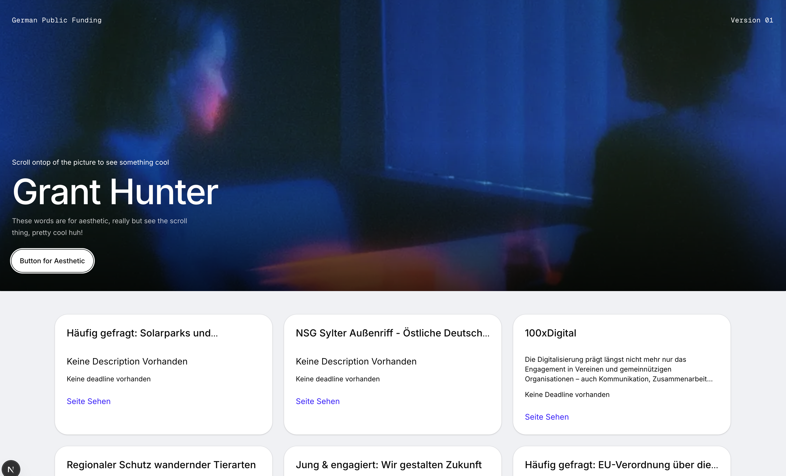

# Grant Hunter - This was a challenge from Chase

## Table of contents

- [Overview](#overview)
  - [The challenge](#the-challenge)
  - [Screenshot](#screenshot)
  - [How To Start The App](#How-To-Start-The-APP)
  - [Links](#links)
- [My process](#my-process)
  - [Built with](#built-with)
  - [What I learned](#what-i-learned)
  - [Challenges](#challenges)
- [Author](#author)
- [Acknowledgments](#acknowledgments)

## Overview

This was a challenge given to me by Chase and because I'm a bit too lazy to explain everything, so here is a summarized version. A small-scale grant discovery platform that automatically scrapes public funding opportunities from German government and foundation websites. Built with a Node.js scraper/backend and a React frontend, it parses unstructured grant pages into a searchable catalog with dedicated detail views for every funding program.

### The challenge

Users should be able to:

- Browse a complete catalog of scraped German public funding programs on the main list view
- Access a dedicated detail view for any single grant program to view full requirements
- View scraped metadata for each listing, including name, short description, external link, and application deadline
- Trigger or access backend scraping processes built with Node.js to update live funding data
- Navigate through programs scraped from select public sources (such as DSEE, BMFSFJ, or BMBF)
- View the optimal layout for the interface across desktop and mobile devices using a responsive React frontend
- Interact with clear hover and focus states across all interactive UI elements
- **Bonus**: View programs parsed from complex, JavaScript-rendered portals (e.g., Aktion Mensch)
- **Bonus**: Persist scraped grant data into a database instead of in-memory or JSON storage

Note: At the time of writing, I didn't get enough time to try parsing content by websites whose content is JavaScript rendered. Also I had fun building this because this was the first time I've actually built a scraper, normally I get to work with already made APIs... It's safe to say that I won't take that privilege for granted 😂

### Screenshot

### How To Start The APP
> Start by installing the necessary dependencies by running `npm run dev` in your terminal then start the scraper by typing this command `npx tsx scripts/scrape-all.ts` then after the scraper is done scrapping, you can start the app by typing `npm run dev`. You can then access the app using your browser by typing visting `https://localhost:3000` or `http://localhost:3000`

### Links

- Solution URL: [GitHub Repository](https://github.com/tesla-ambassador/grant-hunter)
<!-- - Live Site URL: [Personal Finance App](https://personal-finance-app-black.vercel.app/) -->

## My process

Buckle up! This was a very fun project to work on. It was a little challenging given that I'd never built a scrapper before and it was my first time using Gemini as my code assistant because I haven't paid for Claude 😭
It wasn't as bad though cause I also had to be creative with the way I approached some of the challenges.

I started off by prompting Gemini to get me a very basic scrapper which I analyzed to figure out how it worked. We used cheerio and we started off scrapping from [DSEE](https://www.deutsche-stiftung-engagement-und-ehrenamt.de) cause it was a little more straightforward. I also used SQlite3 as a DB so that I could persist the data

I then created a fresh Next.js app cause it works a fullstack framework, created the necessary files for this project and as soon as I was running the basic scrapper locally, I started figuring out how each piece of code was tied to the next. I also periodically asked Gemini the purpose of some of the libraries and functions used. Within about 30 minutes, I had a basic understanding of the whole thing and now came the actual work... scaling (albeit at a microscale 😂)

As soon as I got consistent results from scrapping from only one site, I decided to increase the number of sites to two but the problem is that I had tailored the scrapper to only one site by using specific classnames to get some of the heading tags and available descriptions. I thought of maybe dynamically passing in my URLs but that would also mean dynamically rendering the rest of the fields that were affected by them and that would yield incosistent results. This led me to ask Gemini for a few options and we came up with an architecture that kind of gave me what I wanted by employing an adaptor that contains the scrapper logic for a particular site that I could store into an array of other adapters and run concurrently on the main scrapper.

As soon as I got it wired up, I thought I employ the scrapper logic from the first scrapper onto the one of the second site but I have never been so wrong. I didn't account for the fact that different websites have different layouts and the approaches that work on some don't necessarily work on the rest. I inspected the second site and realized that the links that led to my target page didn't have a common word in their `href`.

The second site used a search filter to bring up the grant funding pages and therefore, I had to implement a hook that employed a search function that passes search parameters in the URL, bypasses pagination links and targets the links inside the result search containers. It took me a while to get my head around this one but it basically employed a similar strategy but in a different way, the links were stored in an array and it was able to be employed on the adaptor that let me scrape the [BFN Page](https://www.bfn.de/). I mean I had thought of scrapping all the links on the page but it would involve a lot more processes to achieve something similar.

Lastly, I put together a rag-tag UI. I mean it was looking too basic at first and tbh even though it's a small project, I can't sleep at night knowing I shipped a nightmarish UI. I also needed an excuse to use [aceternity UI's Chromatic Image](https://ui.aceternity.com/components/chromatic-image) that was the only crazy part of the UI and It was just a matter of plugging and playing... changing a few words, these days it really doesn't cost nothing to have something good looking. Also I just discovered that tailwind's components have been moved to tailwind plus. But back to the point, I thought it a good idea to take an hour or two to make it look a little less ugly.

> Bonus Note: If I get time even after submitting, I'll still try to give it a try and scrape from the JavaScript rendered site... I'll see tomorrow.

### Built with

- Next.js
- Tailwind CSS
- Shadcn/ui
- Gemini
- Cheerio

### What I learned

I learned how to script a scrapper and how to also make a multimodal scrapper that can be used to adapt to sites with different layouts and rendering methods. I also learned that it's possible to use Gemini as a coding assistant, I'd still prefer Claude but I'm broke 😂 It was genuinely my first time coding with Gemini and it did better than I expected.

I also used a javaScript set for the first time since I started writing in this language from 2021. I didn't even know JavaScript had sets the only time I used a set was when writing python. But yeah, it was helpful for temporarily storing the links I scraped from the site to prevent duplicate records and then storing them in an array that is returned by the function.

I learned that I have to employ different strategies to scrape different sites and a lot more on how scrappers worked, what they read and problems one could encounter when trying to scrape a site. Even though I didn't get to scrape a site that is SSR, I learned how to find out if a site is SSR from the network tab. I can usually tell if it was made by REACT because of an extension I have on my browser called [React Tools](https://react.dev/learn/react-developer-tools) but I couldn't tell if the site was SSR or not.

I learned how to use cheerio and a few other libraries like SQlite3 which I used to persist the data. It felt really rewarding and I had lots of fun building out this app.

### Challenges

I thought it would be fun to integrate images and I spent quite some time trying to get it done cause I thought it'd look great for the single view page but at the moment, I've got nothing and time is running out till I'm required to submit but I'll cycle back when I get time and see how to integrate those images. I had actually succeeded on the first site but that was because the scrapter was returning full image tags as part of the headers and therefore, I just parsed those strings into HTML but that wasn't a great solution because I still needed headers.

## Author

- Website - [tesla-ambassador](http://portfolio-pink-ten-21.vercel.app)
- Frontend Mentor - [@tesla-ambassador](https://www.frontendmentor.io/profile/tesla-ambassador)
- Twitter - [@Mbawalla\_](https://x.com/Mbawalla_)

## Acknowledgments

I'd like to thank my Chase for this challenge, I had fun doing it and it really fired up my neurons also special thanks to Gemini for exceeding my expectations 😂
